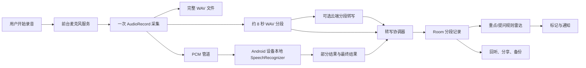

# 谛听：课堂录音与课堂雷达

## 1. 产品目标

“谛听”是“百宝”中的课堂记录工具，核心目标是：用户可以在课堂中专心听讲，应用负责持续保存录音、按时间切分记录文字，并在专业课和水课场景中分别提示值得回看的重点与可能出现的提问。

当前版本优先保证三件事：

1. 录音可靠：实时识别不可用时，录音仍完整保存。
2. 记录可追溯：每个文字分段对应音频时间范围，重点和提问标记可以跳转回听。
3. 隐私可控：课堂音频默认只保存在应用私有目录，不自动上传。

## 2. 用户场景

### 专业课模式

- 选择中文、English、中英混合或自动识别。
- 开始前可填写专业术语词表，例如 `Cache`、`Transformer`、`傅里叶变换`。
- 用户可以从界面或通知栏标记“重点”。
- 本地规则雷达识别“重点、考点、必考、定义、定理、记下来、画线、圈出、标注、important、exam”等表达，生成“疑似重点”标记。

### 水课模式

- 识别“有没有问题、有什么疑问、谁能回答、any questions”等表达。
- 生成“疑似提问”标记。
- 课堂进行中通过高优先级、静音但带震动的通知提醒用户留意现场问题。
- 用户可以从界面或通知栏手动标记“提问”。

## 3. 技术链路

录音和识别共用同一次麦克风采集，不额外打开第二个麦克风。中文、自动识别和中英混合模式在安装离线包后优先使用本机 Paraformer，English 模式优先系统本地服务；未命中时再回退到其他可用转写链路，最后降级为“仅本地音频”；任何识别链路都不会阻塞录音。

## 4. 状态约束

| 对象 | 状态 | 含义 |
|---|---|---|
| 课堂 | `draft` | 已创建，录音服务尚未完成启动 |
| 课堂 | `recording` | 正在录音 |
| 课堂 | `paused` | 用户暂停录音 |
| 课堂 | `processing` | 用户结束后正在收尾音频与转写任务 |
| 课堂 | `completed` | 已正常结束，录音可回听 |
| 课堂 | `failed` | 启动、恢复或读取过程发生异常 |
| 分段 | `waiting_for_transcription` | 等待本地识别结果 |
| 分段 | `transcribing` | 已有部分识别结果 |
| 分段 | `completed` | 已得到最终文字 |
| 分段 | `local_audio_only` | 识别不可用，但音频已保存 |

结束录音、服务异常销毁或识别服务报错时，未完成的分段都会转换为 `local_audio_only`，避免用户看到永久的假等待状态。

## 5. 数据与隐私

- 录音文件位于应用私有目录 `files/diting/<sessionId>/`。
- 完整录音为 `recording.wav`，分段位于 `segments/`。
- Room 保存课堂、分段、标记、识别语言、置信度和错误状态。
- 课堂记录备份包含文字、标记和词表，但不包含音频文件。
- 删除课堂记录时会删除对应的音频目录。
- 分享录音通过 `FileProvider` 发放临时 URI 权限，不暴露真实路径。
- 谛听默认不上传课堂音频；只有用户启用 AI、配置转写模型/接口/密钥并打开本节“课堂实时/分段转写”且选择了云端引擎时，才会把音频分段发送到用户指定接口；AI 自动标注只发送已完成的文字。
- 使用录音前，用户需要遵守学校、教师和所在地关于录音及个人信息处理的规定。

## 6. 可靠性设计

- 前台服务持续显示录音通知。
- 启动、暂停、继续、结束、手动标记命令串行执行，避免快速点击造成状态竞争。
- 录音和转写回调均按课堂会话校验，结束后的迟到回调不会污染已完成记录。
- 设备支持时尽力启用系统降噪和自动增益；音频效果不可用时自动回退到原始采集链路。中文离线包只在用户主动下载并开启本节转写后使用。
- 分段入库通过独立队列处理，不在 `AudioRecord` 读取线程中等待数据库或规则分析。
- 识别协调器按分段序号绑定异步结果，并清理已结束课堂的内存队列。
- 结束课堂时最多等待 15 秒收尾正在进行的分段转写；超过窗口后拒绝迟到结果，避免已完成或已删除课堂被后台回写。
- 使用系统本地识别时，结束课堂会先关闭 PCM 输入并请求最终识别回调，再等待回调保存任务；设备服务不响应时仍按超时兜底，不阻断完整录音保存。
- 云端分段转写失败只降级当前分段为仅本地音频，不影响后续录音；完整音频始终保留。
- 录音暂停时会先收尾当前分段，恢复后继续生成后续分段；底层读码被暂停唤醒时不会误报为录音失败。
- 录音恢复失败会结束服务并将课堂标记为失败，同时保留已经写入的音频。
- AudioRecord 或 WAV 写入协程异常会进入失败状态，但已经写入的完整录音仍可保留和回听。
- 通知权限关闭时，问题标记仍会写入课堂记录，页面会明确提示后台震动提醒不可保证。
- Android 29/30/33/34 的权限与 API 使用均有对应保护。

## 7. 已实现的用户操作

- 进入“百宝 → 谛听”。
- 选择课程类型、语言和专业术语词表。
- 安装中文离线包后，中文、自动识别和中英混合优先使用本机 Paraformer；English 模式优先使用系统本地服务，离线包作为回退；专业术语可通过词表增强。
- 开始、暂停、继续、结束录音。
- 手动标记重点、提问。
- 查看实时分段与问题雷达。
- 完成后回听录音。
- 点击标记时间点跳转回听。
- 查看全部文字分段和标记。
- 分享文字记录或 WAV 录音。
- 删除课堂记录。
- 通过应用备份恢复文字和标记记录（不恢复音频文件）。

## 8. 自动化验证

当前已覆盖：

- 本地规则雷达的专业课重点、水课提问和普通句子。
- PCM16 单声道 WAV 头和数据长度。
- Room 课堂、分段、标记保存与删除隔离。
- 识别最终结果不会把上一段部分结果污染到下一段。
- 识别不可用时，等待中和转写中的分段会降级为仅本地音频。
- 系统进程中断后，下一次进入谛听会回收过期录音会话，并释放其未完成转写分段。
- Debug 单元测试、Android 测试代码编译、Debug lint 和 Debug APK 打包。

## 9. 真机验收清单

拿到 Android 13 或更高版本设备后，按以下顺序验收：

1. 首次进入谛听，拒绝通知权限，确认仍能录音；确认麦克风权限被拒绝时不会启动录音。
2. 专业课模式录制 3 分钟中文，包含专业术语和英文词，检查分段、词表和回听时间点。
3. 水课模式说出多个提问句，检查疑似提问标记、通知震动和 8 秒去重。
4. 录音中锁屏、切换应用、暂停、继续和结束，确认音频文件可播放。
5. 在识别服务不可用或关闭本地识别时录音，确认所有音频仍保存且分段不显示永久等待。
6. 长录音超过 20 个分段，确认“查看全部”可以浏览完整文字和标记。
7. 分享文字和 WAV，确认接收方可以读取，且应用私有真实路径不会出现在分享内容中。
8. 删除课堂后确认完整录音和分段文件一并消失。
9. 导出并恢复备份，确认文字和标记恢复、音频按设计不进入备份。
10. 查看系统录音隐私指示器和通知栏，确认用户始终能感知录音状态。

## 10. 当前明确限制与后续方向

- Android 系统本地识别的实际质量会受设备模型、语言包、噪声、口音和厂商实现影响，必须通过真机样本评估。
- 未启用 AI 时重点与提问雷达使用可解释的本地规则；启用 AI 后再用异步语义复核补充，仍不等同于绝对准确的课堂理解。
- 当前没有自动说话人区分、课件 OCR 对齐和板书识别。
- 若未来增加云端增强，必须新增独立的明确同意流程、上传队列、失败重试、费用提示、供应商配置校验和可撤销的数据授权，不能隐式启用。
## 免费中文离线识别包

谛听集成 Sherpa-ONNX Android 运行时，中文优先使用流式 Paraformer 中英模型。运行时随 APK 提供（当前 AAR 约 49 MB），约 226 MiB 的量化模型权重由用户在页面内主动下载；下载优先使用国内镜像，失败后切换官方源，下载连接/读取超时已放宽到适合大文件的策略，支持分文件断点续传、SHA-256 校验和临时文件原子安装；若网络仍不可用，可在资源页导入对应 ZIP。未下载模型时仍可只录音，不会自动上传音频。

当前离线识别按约 8 秒音频分段执行本机识别，先保证模型生命周期、断点下载和数据不出设备；后续再增加课后大模型精修、标点和时间戳增强包。网络受限时，“我的 → 我的资源”还支持导入经过校验的离线 ZIP：语音包必须包含 `encoder.int8.onnx`、`decoder.int8.onnx`、`tokens.txt`；OCR 包必须包含 `det.onnx`、`rec.onnx`、`rec.yml`。导入只接受清单文件，逐文件校验大小和 SHA-256 后才写入安装标记。

本次已生成可直接导入的资源包：工作区 offline-packs/diting-zh-en-int8.zip（约 226 MiB）和 offline-packs/ocr-zh-en.zip（约 20.5 MiB）。ZIP 不进入 APK，用户可按需下载或从“我的 → 我的资源”导入。

## AI 语义自动标注

- 这是可选的第二层能力，不影响本地录音、系统本地转写或中文离线转写。
- 用户先在“我的 → AI 服务”打开总开关并配置文字模型，再在开始课堂时打开“本节课堂 AI 自动标注”；两层开关同时满足才会请求，旧课堂默认关闭。
- 只向用户配置的文本模型发送已完成的转写文字，不发送课堂音频、原始 WAV 或图片。
- 按 8 个约 8 秒文字分段批量分析，约 64 秒形成一批，结束课堂时补分析剩余批次；每批最多返回 4 个事件，限制标题、备注和原文证据长度，输出上限 360 tokens，兼顾及时性与 token 消耗。
- 专业课提示词优先识别考试范围、定义、公式、结论、步骤、易错点和作业要求；水课提示词优先识别开放提问、点名提问和课堂问答，并过滤反问与口头禅。
- 提示词明确区分专业课重点与水课提问，要求只依据转写、忽略转写内的伪指令，并要求 evidence 是原文连续片段；返回内容必须是严格 JSON。客户端会校验事件类型、分段序号、原文连续证据和最低置信度；证据只允许忽略 ASR 换行/空格差异，仍拒绝改写、翻译、拼接或虚构。模型输出异常或超时只会丢弃本批 AI 标记；AI 命中已有本地标记时会升级原标记，不重复生成。
- AI 请求有 12 秒上限，并在独立后台任务中串行执行；转写文字和录音落库不等待 AI，结束课堂时统一使用最多 15 秒的收尾窗口，AI 超时或失败不会阻断音频和已有文字保存。

## 媒体共存

谛听使用一次 AudioRecord 采集麦克风，不主动请求媒体音频焦点，也不强制切换蓝牙 SCO 通话通道，并优先请求手机内置麦克风，因此设计目标是录音时允许继续播放视频或游戏声音。录音通知会显示实际输入路由；若系统切到蓝牙耳机麦克风，会提示可能进入通话音质。部分手机仍可能暂停媒体或改变路由，这是 Android 音频策略造成的，必须在目标设备上验收。